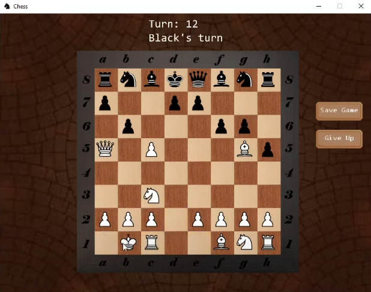

# Trabalho 1 - Técnicas de Desenvolvimento de VideoJogos
Repositorio do primeiro trabalho de TDVJ

Clone e documentação de um projeto de terceiros criado usando a framework do MonoGame.

Realizado por: Diana Silva 29625 e Lucas Alves 27922

Projeto / Repositório de escolha: https://github.com/crlimacastro/just-chess/tree/master

Código / Documentação de um jogo com o nome “Just Chess”, realizado por um utilizador, Camilo ( https://github.com/crlimacastro ).

Data da última alteração / Data de término do projeto: 31 / 3 / 2024

Linguagem de escolha: C#

Framework: MonoGame

Demo do jogo: https://www.youtube.com/watch?v=zpxmF3DNSlo

Breve descrição: Aplicação de xadrez com implementação de undo / redo e guardar / carregar o estado do jogo para um ficheiro.


Imagem disponibilizada pelo criador:




# Análise do Projeto "Just Chess":

Como o nome indica, é um projeto que envolve criar o jogo de tabuleiro xadrez em C# junto com a framework do MonoGame. O criador destaca também duas funcionalidades adicionadas que podem diferenciar o projeto do jogo de tabuleiro original, estas sendo a função de voltar e refazer a jogada, tal como poder guardar e carregar o estado do jogo, podendo voltar mais tarde para o terminar.

O projeto aparenta estar funcional (não conseguimos testar devido ao sistema operativo, mas no video desponibilizado pelo criador ele demonstra como funciona o jogo), no entanto, observam-se alguns problemas com as nomenclaturas dos ficheiros, criando um pouco de confusão, havendo vezes em que é necessário adivinhar o conteúdo do ficheiro. Além disso, a organização geral dos mesmos deixa a desejar, pois as pastas que contêm os ficheiros não sugerem nada em concreto para se conseguir antecipar o seu conteúdo.

Por fim, há falta de comentários no próprio código, o que torna difícil perceber o que o criador fez sem ter o input do mesmo sobre o que estava a tentar obter com as funções criadas e até mesmo o que às vezes estava a pensar para que serviriam as mesmas. Observa-se também que até o ReadMe encontra-se um pouco vazio para um projeto com tantos passos e ficheiros.


Observações / Explicações / Comentários ao código -


**Content folder:**
Todos os pngs precisos para o jogo, incluindo o tabuleiro e peças, contém adicionalmente um folder com todas as fontes usadas no jogo 

## Game Objects folder:

### Board folder:

**Chessboard.cs**

	Usa a public const int BoardDimensions = 8 para dar set das dimensões do próprio tabuleiro, segue o standard 8x8;

	Usa o construtor  public ChessBoard() : base() para inicializar as tiles, pondo-as na posição correta dentro da chessboard edge texture;

	A função protected override void OnLoad(MonoGameApp app) é chamada para dar load das texturas e aplicá-las nas tileboards, posicionando as corretamente:
```ruby
	if (x % 2 == 0 && y % 2 == 0)
	return whiteTileTexture;
	else if (x % 2 == 1 && y % 2 == 0)
	return blackTileTexture;
	else if (x % 2 == 0 && y % 2 == 1)
	return blackTileTexture;
	else
	return whiteTileTexture;
```

	Depois do objeto criado e de termos as propriedades definidas, a função OnDraw(SpriteBatch spriteBatch) é chamada para desenhar os elementos no ecrã (actually displaying elements belongs to this function, that is called every frame of the game aka os elementos só são representados no ecrã quando esta função é chamada);


**Tile.cs**
	
	Estabelece as coordenadas(letra e número) para cada tile no tabuleiro.

**Tileboard.cs**

	Define a classe Tileboard, definindo as suas propriedades, como dimensões; calcula a distância entre as tiles e verifica se uma tile está em risco, tendo uma função que devolve um bool, public bool IsTileThreatened(Tile tileBeingChecked, Team pieceTeam), e outra que devolve as peças que puseram essa tile em risco, public bool IsTileThreatened(Tile tileBeingChecked, Team pieceTeam, out IEnumerable<Piece> threateningPieces).

### Pieces folder:
	
	Contém um script para cada peça de xadrez específica, de modo a estabelecer as regras para cada tipo de peça, sendo assim possível, analisar posteriormente no ficheiro Piece.cs, o uso desses mesmos scripts consoante a peça identificada.

**MainMenuBackground.cs:**
		
	Define a velocidade do background no menu principal.
	
**Piece.cs:**
		
	Define uma classe abstracta para as peças do jogo, incluindo as propriedades da equipa à qual pertence, e posição no tabuleiro. Utiliza um enum para definir as equipas em jogo, ​​public enum Team { White, Black }. Estabelece um método para verificar se a peça já foi movida ou não, através de um bool, e outra de forma a obter os movimentos que são possíveis a partir de uma posição específica para a peça específica. Inclui ainda funções para verificar a equipa a que pertence uma peça, public bool IsDifferentTeam(Piece piece), uma função para verificar se uma jogada é possível, public virtual bool IsPossibleMove(Tile tile).


## MonoGameEngine folder:

	Contém pastas para o framework criado pelo autor do repositório.


## MoveSystem folder:

**ICommand.cs**

		Declara o método Execute e Undo.

**Move.cs**

		Declara o move, faz com que o novo move seja assumido e então por consequência haja overwrite dos dados da peça movida.

**MoveCommand.cs**	

		Aqui têm duas funções muito importantes que fazem atualizar ou desatualizar o estado da board, basicamente faz com que seja possível ver o move na board e da update as variáveis de jogo, turno, gamestate e atualiza o tint do tile e deseleciona a peça.
	Faz o contrário para a outra função, que é reverter o estado um turno para traz.
	Também é possível retornar depois do jogo dar por terminado.

```ruby
	if (_gameManager.StateMachine.CurrentState is WaitingOnFinishedGame)
	{
	_gameManager.ReturnFromGameFinished();
	}
```

**MoveManager.cs**

		Utilizado para gerir a movimentação no jogo, utiliza desta forma um Stack para guardar os movimentos executados. Contém métodos para executar o movimento, undo and redo um movimento, e para limpar todos os movimentos no stack.

**UndoRedoStack.cs**

		Guarda o estado do último move e do último undo.
		Dá clear nos moves.
		Funções para ser possível dar undo e redo nas peças sem que elas se dupliquem e ou desapareçam.


## Save System folder:
	
**ChessSaveData.cs**
		
		Salva as coordenadas de todas as peças e insere-as numa lista

**ChessSaveManager.cs**

	Cria ficheiro binário na path desejada e armazena as variáveis necessárias para o reinício do jogo.

	
## StateSystem folder:

### States folder:

**MovingPiece.cs**

			Adds/Removes Tints.

**SelectingPiece.cs**
	
			Código Incompleto

**WaitingOnFinishedGame.cs**
			
			Código Incompleto

**ChessGameManagerState.cs**
	
		Get / Set game manager

**ChessGameManagerStateMachine.cs**

		If “Game state != NULL” ele dá exit.
		Creates a generic object “Game state”, and enters the class(?)	

	
**State.cs**

		Has a state class.


**StateMachine.cs**

		Set States.
	

### Properties/AssemblyInfo.cs

	Assembly code, não foi criado pelo o utilizador.


## Scenes folder:

**SceneMainMenu.cs**
		
		Create the Main menu background and adds the “Play”, “Load” ,“Quit” buttons. Makes it possible to click the buttons.

**ScenePlay.cs**
	
		Create the Game background as well as add some buttons and other important trackers / Labels. Makes it possible to click all the buttons.
		Shows the end game labels, “White Wins”, “Black Wins” and “Tie”.

## TurnSystem folder:

**TurnManager.cs**

		Código para definir turnos, e a vez de quem joga. E guarda também o turno anterior caso seja para voltar. No caso de carregamento de um jogo, da set no turno em que estava anteriormente.

## Ficheiros fora de folders:

**ChessGame.cs**

		Inicializa algumas cores, deixa o mouse visível e certifica-se que o jogo inicia na cena do “ Main Menu”, Também cria uma emergency exit no escape key 

```ruby
		// Emergency exit on ESC key
            	if (MonoGameEngine.Keyboard.IsKeyUp(Keys.Escape))
            	{
                AppManager.StopApp() }
```

**ChessGameManager.cs**
	
		Neste ficheiro ele trata de tudo o que é relacionado com o jogo, regras de movimento, verificações de início / término de jogo, desfazer e refazer ações, criar as peças e localizá-las. Também tem a função para um player poder desistir da partida. Existe uma função para mostrar os moves possíveis que não deixariam o próprio jogador em cheque. Por último, ele guarda o estado do jogo num ficheiro binário.
 

**Program.cs**

		Início da aplicação. (ficheiro a correr caso possível testar o jogo)
